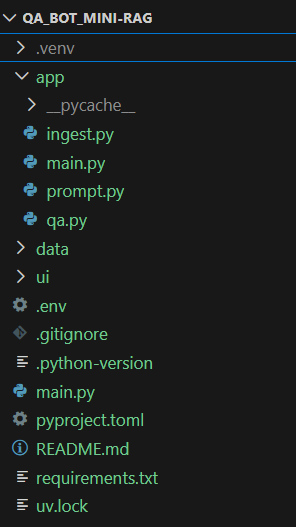

### 1. MINI QA BOT & Description

A lightweight RAG system that answers questions based on local PDF/Markdown documentation using Google Gemini

### 2. Core Features
Use a bulleted list to highlight capabilities:
##### Contextual Q&A: 
Answers questions based specifically on provided documents.
##### Markdown/PDF Support: 
List the file types the bot can ingest.
##### Fast Retrieval: 
Mention the vector store used FAISS for efficient searching. 

### 3. Tech Stack
List the modern tools being used:
- Orchestration: LangChain.
- LLM: Google Gemini (via google-genai SDK).
- Package Manager: uv (for high-speed performance).
- Vector Database: FAISS(Local). 

### 4. Getting Started
Provide clear setup instructions:
Prerequisites: Python 3.12+ and a Google AI Studio API Key.
Installation:
bash
###### Install uv if you haven't already

`powershell -ExecutionPolicy ByPass -c "irm https://astral.sh/uv/install.ps1 | iex"`

After installed, kindly check the status whether its correctly installed or not

`uv --version`

###### Install dependencies
`uv sync`

### 5. Project Structure

Below is the directory structure for the `qa_bot_mini-rag` project:

*   **QA_BOT_MINI-RAG**
    *   `.venv/` (Virtual environment folder)
    *   **app/** (Source code directory)
        *   `__pycache__/`
        *   `ingest.py`
        *   `main.py`
        *   `prompt.py`
        *   `qa.py`
    *   **data/** (Storage for source documents)
    *   **ui/** (User interface files)
    *   `.env` (Environment variables file - ignored by Git)
    *   `.gitignore` (Git exclusion rules)
    *   `.python-version` (Specifies Python version for `uv`)
    *   `main.py` (Alternate/Root level entry point)
    *   `pyproject.toml` (Project configuration and dependencies file)
    *   `README.md` (This file)
    *   `requirements.txt` (Legacy dependency list / reference)
    *   `uv.lock` (Locked dependency versions for reproducible installs)

### 6. How it Works (The RAG Pipeline)

| Step | Description |
| :--- | :--- |
| Ingestion | Documents are loaded and split into semantically meaningful chunks. |
| Embedding | Chunks are converted into vectors using an embedding model. |
| Retrieval | When a user asks a question, the system finds the most relevant chunks. |
| Generation | The LLM generates an answer using only the retrieved context. |

### 7. Execution

- Method 1: Use the uv venv command (Manual Creation)

Create the virtual environment
`uv venv qa_bot_mini_rag`

- Method 2: Let uv sync create it automatically (Recommended)
`uv sync`

###### Activating the Environment

CMD : `.\qa_bot_mini_rag\Scripts\activate`

Once activated, kindly execute the below commands.

- `uv add -r requirements.txt`
- `get the google gemini api key from gemini studio and set the environment variables in windows`

To run the final commands
- `streamlit run ui/app.py`
- `uvicorn app.main:app --reload`

## Thanks for reading this so far. its END

