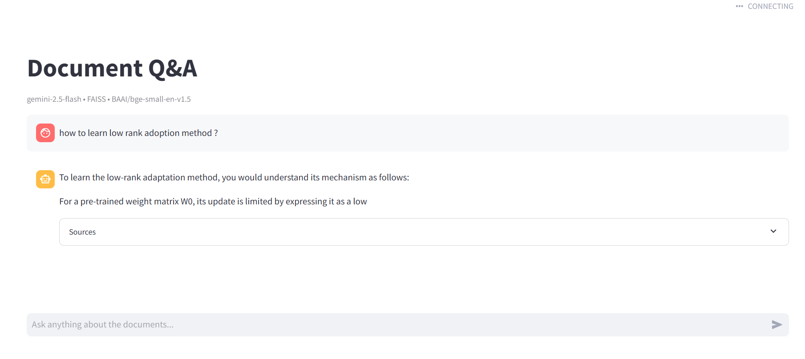

# QA Bot Pro – Document Q&A with RAG

**A simple yet powerful Retrieval-Augmented Generation (RAG) chatbot that lets you upload PDF, DOC/DOCX, or TXT files and ask intelligent questions about their content.**

Powered by Google Gemini + FAISS vector store + modular Python backend + Streamlit UI.

  
*(Output `UI.png` screenshot)*

## ✨ Key Features

- **Supported formats**: PDF, Word (.doc/.docx), Text (.txt)
- Smart document loading, chunking & embedding
- Persistent FAISS vector index (saved in `data/faiss_index`)
- Fast retrieval + generation with **Google Gemini**
- Clean, interactive **Streamlit web UI** for upload + chat
- Modular design: easy to swap embeddings, chunk strategies, or LLMs

## 🛠 Tech Stack

| Component          | Technology                          |
|--------------------|-------------------------------------|
| LLM                | Google Gemini (via `google-genai`)  |
| Embeddings         | `embeddings.py` (likely Google or sentence-transformers) |
| Vector Store       | **FAISS** (local, persistent)       |
| Document Loaders   | Custom in `document_loaders.py`     |
| Chunking           | `chunking.py`                       |
| Retrieval          | `retrieval.py`                      |
| RAG Pipeline       | `rag.py`                            |
| UI                 | **Streamlit** (`ui/main.py`)        |
| Configuration      | `config.py` + `.env`                |
| Python             | 3.10+                               |

## 🚀 Quick Start

### Prerequisites

- Python 3.10+
- Google API Key (Gemini) → [Get it here](https://aistudio.google.com/app/apikey)

### 1. Clone & Setup

```git clone https://github.com/jagann8/Gen-AI/tree/main/Projects/3.%20qa_bot_pro```

### 2. Virtual Environment & Install
Bash
```python -m venv .venv```
Windows
```.venv\Scripts\activate```
macOS/Linux
```source .venv/bin/activate```

```pip install -r requirements.txt```

### 3. Add API Key
Create .env in root (or copy from .env.example if you add one):
envGOOGLE_API_KEY=your-gemini-api-key-here

### 4. Run the App
Bash/CMD
```streamlit run ui/main.py```

Open http://localhost:8501

Upload one or more PDF / DOCX / TXT files
Wait for indexing (first time creates data/faiss_index)
Ask questions like:
- "What are the main findings?"
- "Summarize section 2.3"
- "Compare Table 1 and Table 2"

📂 Project Structure
```bash
QA_BOT_PRO/
├── app/                      # Core RAG logic
│   ├── __init__.py
│   ├── chunking.py           # Text splitting logic
│   ├── config.py             # Constants, paths, settings
│   ├── document_loaders.py   # PDF / DOCX / TXT loaders
│   ├── embeddings.py         # Embedding model init
│   ├── rag.py                # Full RAG chain / answer generation
│   ├── retrieval.py          # Retrieve relevant chunks
│   └── vectorstore.py        # FAISS load/save/indexing
├── data/
│   ├── documents/            # Put your PDFs, DOCs, TXTs here
│   └── faiss_index/          # Auto-created FAISS index files
├── ui/
│   └── main.py               # Streamlit UI – entry point
├── .env                      # API keys (git ignored)
├── .gitignore
├── image.png                 # Screenshot (add more!)
├── main.py                   # (optional backup/entry)
├── requirements.txt
├── README.md
└── ... (IDE files, pyproject.toml, uv.lock, etc.)